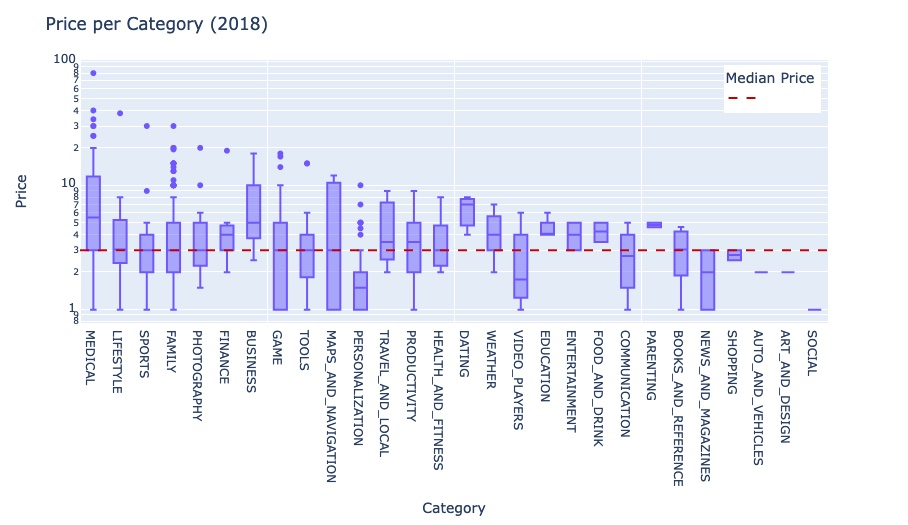

# Compare thousands of apps in the Google Play Store with Colab Notebooks, Pandas and Plotly Express.
- 👋 Hi, I’m @WilliamSpanfelner
- 👀 I’m interested in using Python with Swift in iOS environments and why it may or may not be desirable.
- 🌱 I’m currently learning Python with the London App Brewery and Angela Yu's [100 Days of Code: 
The Complete Python Pro Bootcamp for 2022](https://www.udemy.com/course/100-days-of-code/) on Udemy.  
- 🧑‍💻  Delve into Google Play Store mobile apps market data. Slice and dice data and create different chart types to make sense of it all. Python and Colab/Jupyter notebooks lends tremendous versatility in presenting and digesting the data.  Will your next app be paid or free? 
- 💞️ I’m looking to collaborate on application development.
- 📫 How to reach me...

[//]: # ([![email](https://img.shields.io/badge/email-wil--1--am%40outlook.com-grey?style=plastic)](mailto:wil-1-am@outlook.com))

